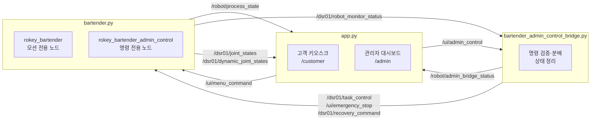
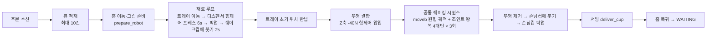

<div align="center">

# CoboTender: 협동로봇 & 그리퍼 기반 바텐더 모션 시스템

**Doosan M0609 협동로봇 + ROS 2 기반 로보틱스 서비스 자동화 시스템**

<br/>


</div>

## 📌 한눈에 보기

| | |
|---|---|
| **문제 정의** | 외식업 인력난·인건비·숙련도 편차 문제를 무인 자동화로 해결 |
| **핵심 기술** | ROS2 2-노드 아키텍처, 힘제어 기반 정밀 제조, 5단계 안전 시스템 |
| **제조 메뉴** | 칵테일 3종 + 스트레이트 6종, 최대 10건 큐 처리 |
| **HMI** | Flask 기반 고객 키오스크 + 실시간 관리자 대시보드 |
| **팀 구성** | 4인 팀 (PM 1, HMI/Safety 1, Robot Control 2) |

<br/>

## 목차

- [1. 프로젝트 개요](#1-프로젝트-개요)
- [2. 시스템 아키텍처](#2-시스템-아키텍처)
- [3. ROS2 토픽 설계](#3-ros2-토픽-설계)
- [4. 메뉴 및 제조 시퀀스](#4-메뉴-및-제조-시퀀스)
- [5. Safety 설계](#5-safety-설계)
- [6. HMI (Flask 웹 UI)](#6-hmi-flask-웹-ui)
- [7. 프로젝트 구조](#7-프로젝트-구조)
- [8. 실행 방법](#8-실행-방법)
- [9. 주요 이슈 및 해결](#9-주요-이슈-및-해결)
- [10. 향후 개선 사항](#10-향후-개선-사항)
- [11. 팀 소개](#11-팀-d-1)

<br/>

---

## 1. 프로젝트 개요

### 배경 및 목표

외식업계의 인력난과 높은 실질 고용비, 숙련도에 따른 품질 편차 문제를 해결하기 위해
**ROS2 제어 기반 협동로봇 무인 칵테일 제조 서비스 자동화**를 구현했습니다.

- ✅ 주문(키오스크) → 제조(로봇) → 서빙 → 복귀까지 **전 과정 무인 자동화**
- ✅ 관리자 대시보드를 통한 **실시간 모니터링 및 원격 정지/복구 제어**
- ✅ 하드웨어 이상(안전정지·비상정지·서보 꺼짐) 감지 시 **관리자 승인 기반 자동 복구**

### 핵심 기술 하이라이트

<table>
<tr>
<td width="33%" valign="top">

**🔀 이중 노드 아키텍처**

모션 전용 노드와 명령 전용 노드를 분리해 블로킹 모션 중에도 정지 명령을 즉시 처리

</td>
<td width="33%" valign="top">

**🛡️ 5단계 안전 시스템**

모션 래퍼부터 비상정지, 하드웨어 복구, 예외 처리까지 계층적 안전 설계

</td>
<td width="33%" valign="top">

**⚖️ 힘제어 기반 제조**

디스펜서 프레스·뚜껑 결합 등 위치 오차에 강건한 force control 적용

</td>
</tr>
</table>

---

## 2. 시스템 아키텍처

**3-프로세스 구조**로 UI, 명령 중계, 로봇 제어를 분리했습니다.


### 로봇 측 2-노드 설계

`bartender.py`는 내부적으로 **노드 2개**를 사용합니다.

| 노드 | 역할 | 특징 |
|---|---|---|
| `rokey_bartender` | DSR 모션 API 전용 노드 | 작업이 없을 때만 메인 루프에서 `spin_once` 수행 |
| `rokey_bartender_admin_control` | UI/관리자 명령 전용 노드 | 별도 `SingleThreadedExecutor` 스레드에서 spin |

이 구조로 **블로킹 모션 실행 중에도 PAUSE / CANCEL / ESTOP / RECOVER 명령을 즉시 수신**할 수 있으며,
ROS2 Humble에서 전역 executor를 두 스레드가 공유할 때 발생하는 wait set 충돌(`IndexError: wait set index too big`)을 회피합니다.

추가로 DSR API를 전혀 호출하지 않는 **0.5초 주기 heartbeat 스레드**가
`/dsr01/robot_monitor_status`를 계속 발행하여, 장시간 블로킹 모션 중에도 브리지가 로봇을 "연결 끊김"으로 오탐하지 않습니다.

---

## 3. ROS2 토픽 설계

| 토픽 | 타입 | 방향 | 설명 |
|---|---|:---:|---|
| `/ui/menu_command` | `bartender_interfaces/Menu` | UI→Robot | 메뉴 주문 (menu: int, 0~8) |
| `/robot/process_state` | `bartender_interfaces/Status` | Robot→UI | 제조 단계 (WAITING 0 ~ RETURNING_HOME 5) |
| `/ui/admin_control` | `std_msgs/String` | UI→Bridge | PAUSE / RESUME / CANCEL / ESTOP / ESTOP_RELEASE / HOME_RETURN / ESTOP_RELEASE_HOME / RECOVER |
| `/dsr01/task_control` | `std_msgs/String` | Bridge→Robot | PAUSE / RESUME / CANCEL / HOME_RETURN / ESTOP_RELEASE_HOME 분배 |
| `/ui/emergency_stop` | `std_msgs/Bool` | Bridge→Robot | True: 소프트 비상정지 / False: **정지 해제만** (홈복귀 별도) |
| `/dsr01/recovery_command` | `std_msgs/String` | Bridge→Robot | RECOVER (관리자 복구 승인) |
| `/dsr01/robot_monitor_status` | `std_msgs/String` (JSON) | Robot→Bridge | FSM/HW 상태·로그·복구 대기 여부 (0.5s heartbeat) |
| `/robot/admin_bridge_status` | `std_msgs/String` (JSON) | Bridge→UI | 정리된 상태 스냅샷 + 로그 최대 80건 (0.3s 주기) |
| `/dsr01/joint_states` · `/dsr01/dynamic_joint_states` | `sensor_msgs/JointState` · `control_msgs/DynamicJointState` | drive→UI | 조인트 각도/속도 (UI에서 라디안→도 변환 표시) |

> **v5.2 no-conflict 규칙**: 관리자 UI는 `/ui/admin_control`만 발행하고,
> `/ui/emergency_stop`은 브리지가 단독으로 분배하여 중복 정지/홈복귀를 방지합니다.
> 브리지는 알 수 없는 명령을 거부하고, **같은 명령 0.8초 내 재수신 시 중복으로 무시**합니다.

### 관리자 명령 흐름 (UI 버튼 → 로봇 동작)

| UI 버튼 (`/api/robot/command`) | 브리지 발행 | 로봇 동작 |
|---|---|---|
| pause / resume | `/dsr01/task_control` PAUSE / RESUME | 모션 사이 경계에서 일시정지 대기 / 재개 |
| estop | `/ui/emergency_stop` True | `MoveStop(DR_SSTOP)` + 주문 큐 클리어, 해제 대기 |
| estop_release | `/ui/emergency_stop` False | 정지 플래그 해제만 수행 (모션 없음) |
| home_return | `/dsr01/task_control` HOME_RETURN | 취소 + 홈복귀 (단, 비상정지 상태면 거부 — 먼저 해제 필요) |
| recover | `/dsr01/recovery_command` RECOVER | 하드웨어 정지 복구 승인 |
| estop_reset (레거시) | `/dsr01/task_control` ESTOP_RELEASE_HOME | 해제 + 홈복귀를 한 번에 수행 |

---

## 4. 메뉴 및 제조 시퀀스

### 메뉴 구성 (9종)

| UI 메뉴 | menu 코드 | 유형 | 레시피 (디스펜서 버튼) |
|---|---|---|---|
| Old Fashioned | 0 | 칵테일 (WHISKEY) | 2 → 3 + 쉐이킹 |
| Mojito | 1 | 칵테일 (VODKA) | 4 → 5 + 쉐이킹 |
| Whisky Sour | 2 | 칵테일 (NON_ALCOHOL) | 5 + 쉐이킹 |
| Macallan 12 ~ Johnnie Walker Black | 3~8 | 스트레이트 1~6 | 해당 버튼 1회 → 손님컵 직행 |

주문 수량이 2 이상이면 UI가 같은 메뉴 명령을 수량만큼 반복 발행하며, 로봇은 **최대 10건 큐**에 적재해 순차 제조합니다.
발행 전 `/ui/menu_command` 구독자 수를 확인(최대 2초 대기)하여, `bartender.py` 미실행 시 "주문 미전송"을 UI에 명확히 알립니다.

### 칵테일 제조 흐름



스트레이트 메뉴는 쉐이킹 없이 **해당 버튼 프레스 → 트레이 픽업 → 손님컵에 바로 붓기 → 서빙**으로 단축됩니다.

| 공정 | 세부 내용 |
|---|---|
| 디스펜서 프레스 | `task_compliance_ctrl` + `set_desired_force`로 X축 방향 +50N 힘제어 누름 (6초 유지). 버튼 위치 오차에 강건 |
| 뚜껑 결합 | Z축 -40N 힘제어 압입 (2초) |
| 쉐이킹 | base 좌표계 상대 원형 `moveb`(반경 20, 5회) + 서로 다른 조인트 왕복 패턴 4종 × 각 3회 (`vel=150, radius=30` 블렌딩) |
| 트레이 관리 | `current_tray_button` 상태 추적으로 목표 버튼에 이미 있으면 pick/place 생략. 제조 완료 시 초기 위치(2번 버튼)로 반납 |
| 그리퍼 | DO1~3 디지털 출력 제어. **"모든 DO OFF 순간 금지" 규칙** — 원하는 DO 먼저 ON → 나머지 OFF. RViz 연동용 `/onrobot/sendCommand` 가상 그리퍼 명령 병행 |

---

## 5. Safety 설계

### 안전 모션 래퍼 (safe wrapper)

`install_motion_wrappers()`가 전역 `movej / movel / moveb / mwait`를 안전 래퍼로 교체합니다.
레시피 코드는 그대로 두고, **모든 모션이 자동으로** 아래를 수행합니다.

- 모션 시작 전: `check_cancel()` — 일시정지 대기(`wait_if_paused`) + 취소 시 `RuntimeError`로 작업 스레드 탈출
- 모션 완료 후(`safe_mwait`): `get_robot_state()`로 하드웨어 상태 확인 → 이상 시 복구 플로우 진입
- 힘제어·붓기 등 대기 구간은 `wait_with_cancel()`로 50ms 단위 취소 감시

### 하드웨어 정지 복구 플로우

| hw_code | 상태 | 복구 절차 |
|---|---|---|
| 5 | PROTECTIVE_STOP (안전정지) | 관리자 Recovery 승인 대기 → `SetRobotControl(2)` → 해제 확인 후 재개 |
| 3 | SAFE_OFF (서보 꺼짐) | 관리자 Recovery 승인 대기 → `SetRobotControl(3)` → 서보 복구 후 재개 |
| 6 | EMERGENCY_STOP (비상정지) | 물리 E-Stop 해제 대기 → 관리자 승인 → 서보 ON → **5초 카운트다운** 후 재개 |

복구 시도 전 `drl_script_stop(DR_QSTOP_STO)`으로 잔여 스크립트를 정리하고, 복구 후 STANDBY 확인까지 검증합니다.
Recovery 대기 중 CANCEL이 오면 대기를 중단하고 작업을 취소합니다.

### 정지 명령 경로 분리

- **소프트 비상정지** (`ESTOP`): 즉시 `MoveStop(DR_SSTOP)` + 큐 클리어. 이후 모든 주문/홈복귀 차단
- **비상 해제** (`ESTOP_RELEASE`): 정지 플래그만 해제. 작업 스레드가 살아있으면 `cancel_requested`를 유지해 안전하게 종료시킨 뒤 홈복귀 가능
- **홈복귀** (`HOME_RETURN`): 비상정지 상태에서는 거부("먼저 비상해제를 누르세요"). 취소 플래그 해제 후 `return_home(ignore_cancel=True)` **raw 모션**으로 복귀 — safe wrapper의 `check_cancel()`에 자체 차단되는 문제 방지
- **해제 + 홈복귀** (`ESTOP_RELEASE_HOME`, 키보드 `b`): 위 두 동작을 순차 수행
- 모든 정지/해제/홈복귀 명령은 **0.8초 중복 억제 + idempotent 플래그** 처리로 브리지·레거시 UI의 이중 발행에도 워커가 중복 생성되지 않음
- IDLE 상태에서의 홈복귀 요청은 SSTOP 없이 홈복귀 워커만 기동 (불필요한 정지로 인한 지연 방지)

---

## 6. HMI (Flask 웹 UI)

### 고객 키오스크 (`/customer`)
- 칵테일 / 스트레이트 / 안주 / 요청사항 카테고리별 주문
- 재고 연동 자동 품절 표시 (스트레이트: 잔량 < 1잔, 칵테일: 레시피 재료 부족)
- 주문 시 로봇 명령 전송 결과(`requires_robot_work`, `sent/failed`)를 응답에 포함해 제조 대기화면 연동

### 관리자 대시보드 (`/admin`, 로그인 필요)
- 현재 조인트 각도 및 조인트별 속도 / 평균 속도 실시간 표시 (`joint_states` + `dynamic_joint_states`, 라디안→도 변환)
- 작업 진행 현황 (WAITING → MAKING → MAKING_DONE → DELIVERING → DELIVERED → RETURNING_HOME)
- 로봇 명령 버튼: 일시정지 / 재개 / 비상정지 / 비상해제 / 홈복귀 / Recovery
- 하드웨어 상태(STANDBY / MOVING / PROT_STOP / EMRG_STOP / SAFE_OFF) + FSM(IDLE / BASIC / PAUSED)
- **이중 연결 감시**: UI↔브리지, 브리지↔로봇 각각 3초 타임아웃으로 끊김 감지
- 시스템 로그 통합 뷰 (브리지 로그 + UI 로그, 최대 100건 병합)
- 재고관리 (병 수 입력 → ml 환산 저장) / 주문 내역 + 금일 매출 합계 / 직원호출·안주 요청 처리

### 데이터베이스 (SQLite)
- `menu` (재고 ml 관리) · `orders` · `order_items` · `staff_requests`
- 주문 시 스트레이트(1잔 30ml)/칵테일 레시피 기준 재고 자동 차감
- 안주·요청사항은 로봇에 전송하지 않고 `staff_requests`로 직원 알림 처리

---

## 7. 프로젝트 구조

```
.
├── bartender.py                        # 로봇 제조/안전 제어 (모션 노드 + 명령 노드)
│   ├── BartenderRobot                  #   레시피 실행, safe wrapper, 복구 플로우, heartbeat
│   └── main()                          #   메뉴 큐 루프 + 키보드 테스트 (a: 비상정지, b: 해제+홈)
├── bartender_admin_control_bridge.py   # 관리자 명령 검증·분배 · 상태 정리 중계 노드
├── app.py                              # Flask 웹 서버 (키오스크 + 관리자 대시보드)
│   ├── DoosanRosBridge                 #   ROS2 구독/발행 브리지 노드 (MultiThreadedExecutor)
│   └── REST API                        #   /api/menu, /api/order, /api/robot/*, /api/inventory ...
├── templates/                          # customer.html, admin.html, inventory.html, orders.html
├── static/                             # 메뉴 이미지 등 정적 리소스
└── database/bar.db                     # SQLite (자동 생성)
```

`app.py`는 `ros2 run`/`ros2 launch`(cobotender 패키지 설치 경로)와 소스 직접 실행 모두에서
templates/static/database 경로를 자동 탐색하도록 `resolve_resource_dir()`를 제공합니다.

---

## 8. 실행 방법

### 요구 환경
- Ubuntu 22.04 / ROS2 Humble
- Doosan Robotics ROS2 패키지 (`dsr_msgs2`, `DSR_ROBOT2`, `DR_init`)
- 커스텀 인터페이스: `bartender_interfaces` (Menu, Status), `onrobot_rg_msgs`
- Python: `flask`, `rclpy`

### 실행 순서

```bash
# 1. Doosan 로봇 드라이버 실행 (실기체 또는 에뮬레이터)
ros2 launch dsr_bringup2 dsr_bringup2_rviz.launch.py mode:=real host:=<ROBOT_IP> model:=m0609

# 2. 로봇 제어 노드
ros2 run <your_pkg> bartender.py
#   키보드 테스트: a+Enter = 비상정지, b+Enter = 해제+홈복귀

# 3. 관리자 중계 노드
ros2 run <your_pkg> bartender_admin_control_bridge.py

# 4. 웹 UI 서버
python3 app.py     # 또는 ros2 run cobotender app
#   고객 키오스크:      http://<HOST>:5000/customer
#   관리자 대시보드:    http://<HOST>:5000/admin  (기본 계정 admin / admin)
```

> app.py는 ROS2 미설치 환경에서도 웹 UI 단독 구동이 가능하도록 `rclpy` / `bartender_interfaces` /
> `control_msgs` import 실패를 각각 안전하게 처리합니다 (해당 연동 기능만 비활성화하고 에러 사유를 UI에 표시).

---

## 9. 주요 이슈 및 해결

<details>
<summary><b>개발 중 마주친 9가지 문제와 해결 과정 펼쳐보기</b></summary>

<br/>

| 이슈 | 원인 | 해결 |
|---|---|---|
| ROS2 executor wait set 충돌 (`IndexError: wait set index too big`) | 전역 executor를 메인 루프와 spin 스레드가 동시 사용 | 명령 노드에 **전용 SingleThreadedExecutor** 적용 |
| 블로킹 모션 중 정지 명령 미수신 | 단일 노드에서 모션 API가 executor 점유 | 모션 노드 / 명령 노드 **2-노드 분리** |
| 중복 정지·홈복귀 이중 실행 | 레거시 UI와 브리지가 같은 토픽 이중 발행 | 브리지·로봇 양측 0.8초 중복 억제 + idempotent 플래그 + 발행 주체 단일화(v5.2) |
| 취소 후 홈복귀가 자체 차단됨 | `cancel_requested=True` 상태에서 safe wrapper의 `check_cancel()`에 걸림 | 홈복귀 직전 플래그 해제 + `ignore_cancel=True` raw 모션 사용 |
| 홈복귀 워커가 종료되지 않고 잔류 | 워커 finally에서 `release_force()` 호출이 일부 상황에서 block | 힘제어 해제는 예외 경로에서만 수행하고 finally에서는 플래그 정리만 수행 |
| 주문이 전송된 것처럼 보이나 로봇 미수신 | DDS discovery 완료 전 publish (구독자 0) | 발행 전 **구독자 수 확인 + 최대 2초 대기**, 실패 시 UI에 원인 표시 |
| 그리퍼 DO 신호 충돌 | 모든 DO가 OFF인 순간 웹로직 기본 상태 오작동 | 원하는 DO 먼저 ON → 나머지 OFF 순서 규칙 |
| 자체 제작 그리퍼 파지력 부족·파손 | 3D 프린팅 유격 및 내구성 한계 | 트레이 손잡이 자체 제작 + 모션/좌표 수정으로 대응 |
| 관리자 브리지 연결 끊김 오탐 | 장시간 블로킹 모션 중 상태 미발행 | DSR API를 호출하지 않는 **0.5초 heartbeat 스레드** 분리 |
| 조인트 속도 표시 부정확 | `dynamic_joint_states`가 J1~J6 순서를 보장하지 않음 | joint_names 파싱 후 인덱스 매핑, 라디안→도 변환 |

</details>

---

## 10. 향후 개선 사항

**기능**
- [ ] 복구 후 중단 지점부터 재실행 (현재: 정지 감지·복구까지 구현, 재동작 로직 미구현)
- [ ] pour 정량 제어: 시간 고정(2s) → 용량 기반 제어 + DB 재고 차감량과 실배출량 연동
- [ ] 커스텀 음료 주문 (블록 조합 UI: pour/stir/shake)
- [ ] 무게 센서 기반 실배출량 측정, 컵 감지 센서로 pick 실패 자동 재시도

**품질 및 운영**
- [ ] 디스펜서·그리퍼 DO 채널 실배선 확정 및 grip/grip_cup 역할 분리 (현재 두 함수 모두 DO3 사용)
- [ ] 제어 코드(~1,450줄) 모듈 분리, 관리자 계정/시크릿 키 환경변수화
- [ ] 마커 인식 기반 자동 캘리브레이션, Grafana 모니터링, Docker 배포 자동화

---

## 11. 팀 D-1

<div align="center">

| 이름 | 역할 | 담당 |
|:---:|:---:|---|
| **이주헌** | PM | 프로젝트 기획·스케줄 관리, 기술 및 기타 문서작업 |
| **김현우** | HMI & Safety | 웹 주문 UI·실시간 대시보드, HMI 인터페이스, Safety 설계 |
| **이윤종** | Robot Control | 로봇 제어 및 통신 시스템, 모션 설계·통합 테스트 |
| **전이준** | Robot Control | 로봇 제어 및 통신 시스템, 디스펜서 제어·배출 모션 설계 |

**협업 도구**


📎 [D-1조 Notion](https://app.notion.com/p/D-1-1-fd620372445f4dfc9be002e034ba4d89) · [최종결과 PPT](https://canva.link/6blo7frnx20xdw2)

</div>

---

<div align="center">

본 프로젝트는 Doosan Robotics ROKEY 지능형 로보틱스 엔지니어 과정의 협동1 프로젝트로 수행되었습니다.

<br/>

**🥂 CoboTender — 오늘의 한 잔을 로봇 바텐더가 준비합니다**

</div>
